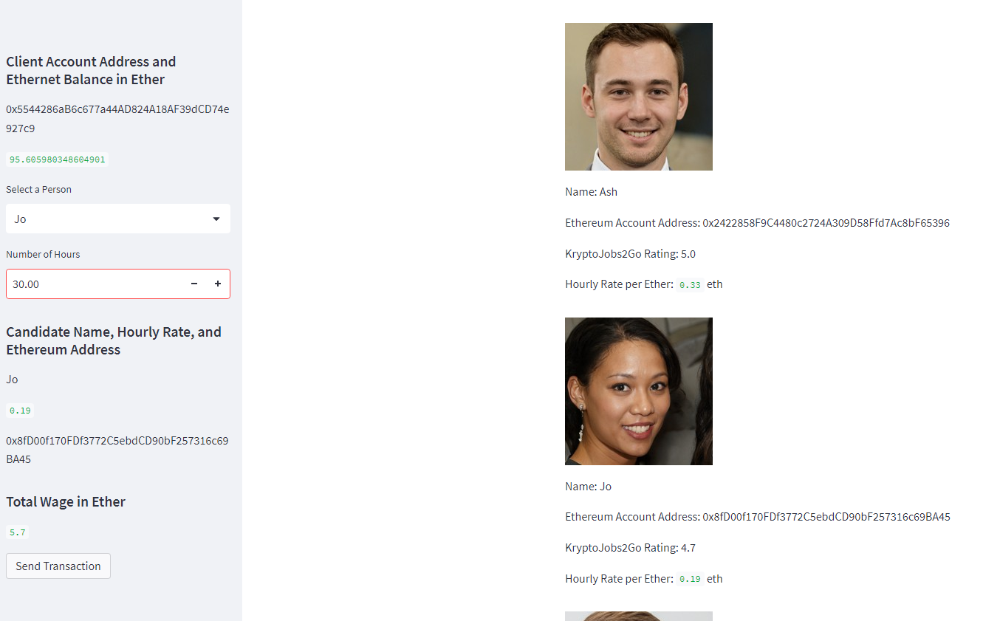

# Module_19_homework

This ledger allows the user who is using the application to find a fintech professional and pay them for their work. 

This had a few errors regarding gas price.

Initially I was getting an error on on the given code as it did not work having gas price as 0.

I then looked around on ganache and found the gas price was 20000000000.

I then tried using getGasPrice to use the number but got this error. 

After more researching I still couldn't get the getGasPrice to work so I ended up hard coding in the number after talking to the teachers.

Below shows screenshots from the working application:

Ganache account balance before transaction.

Ganache account balance after transaction.

Inputs on sidebar of website

Sidebar after transaction

